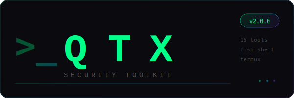

<p align="center">
  
</p>

<h3 align="center">Termux Security Toolkit — Pentest from your phone</h3>

<p align="center">
  <a href="https://github.com/ykrishhh/qtx/releases"></a>
  <a href="https://github.com/ykrishhh/qtx/blob/main/LICENSE"></a>
  <a href="https://github.com/ykrishhh/qtx"></a>
  <a href="https://github.com/ykrishhh/qtx"></a>
  <a href="https://github.com/ykrishhh/qtx/stargazers"></a>
</p>

<p align="center">
  Animated banner · Smart prompt · Syntax highlighting · Fish shell · 14 security tools
</p>

---

## Quick Start

```bash
pkg install git fish eza bat starship nmap curl python
git clone https://github.com/ykrishhh/qtx.git
cd qtx
chmod +x install.sh
./install.sh
```

Restart Termux. Done.

## Security Toolkit

| Tool | Shortcut | What it does |
|------|----------|--------------|
| `tk-scanner` | `scan` | Network port scanner (nmap) |
| `tk-recon` | `recon` | OSINT — DNS, headers, subdomains |
| `tk-audit` | `audit` | Password strength auditor |
| `tk-ssl-check` | `ssl` | SSL/TLS certificate inspector |
| `tk-hash-id` | `hashid` | Hash identification & cracking |
| `tk-log-analyzer` | `logs` | Auth log brute force detector |
| `tk-vuln-check` | `vuln` | Web vulnerability scanner |
| `tk-wifi-recon` | `wifi` | WiFi network scanner |
| `tk-dir-brute` | `dirbrute` | Directory brute-forcer |
| `tk-nikto-scan` | `nikto` | Nikto with Termux fixes |
| `tk-qtx-hunt` | `hunt` | **Run all tools in parallel** |
| `tk-qtx-fm` | `fm` | Terminal file manager |
| `tk-qtx-net` | `net` | Network speed & latency test |
| `tk-setup` | — | Environment setup |
| `tk-uninstall` | — | Clean removal |

### Usage

```bash
scan 192.168.1.1 -T           # quick port scan
recon example.com -d          # deep recon
ssl google.com -c -t          # check SSL + TLS
vuln example.com              # find web vulns
hunt example.com              # run ALL tools in parallel
fm ~/repos                    # browse files
net -a                        # speed + latency test
```

## Shell Features

- **Animated ASCII banner** — changes every session
- **Smart prompt** — customizable name via starship
- **Fish shell** — with eza (ls), bat (cat), syntax highlighting
- **Tab completions** — for all 13 commands
- **Auto-fixes** — `/tmp` permissions, Nikto SSL, PATH setup

## Documentation

| File | Description |
|------|-------------|
| [CHANGELOG.md](CHANGELOG.md) | Release history |
| [FEATURES.md](FEATURES.md) | Roadmap & planned features |
| [TROUBLESHOOTING.md](TROUBLESHOOTING.md) | Real Termux problems & fixes |
| [CHEATSHEET.md](CHEATSHEET.md) | Quick security commands |

## Project Structure

```
qtx/
├── assets/             # Logo, font, colors, motd, starship
├── tools/              # 14 security tools + lib/
├── completions/        # Fish tab completions
├── install.sh          # One-shot installer
└── docs/               # Plans & specs
```

## Credits

- **Dev** [@harry6e](https://github.com/harry6e)
- **Original theme** [termuxvoid](https://github.com/termuxvoid)

## License

[MIT](LICENSE)
