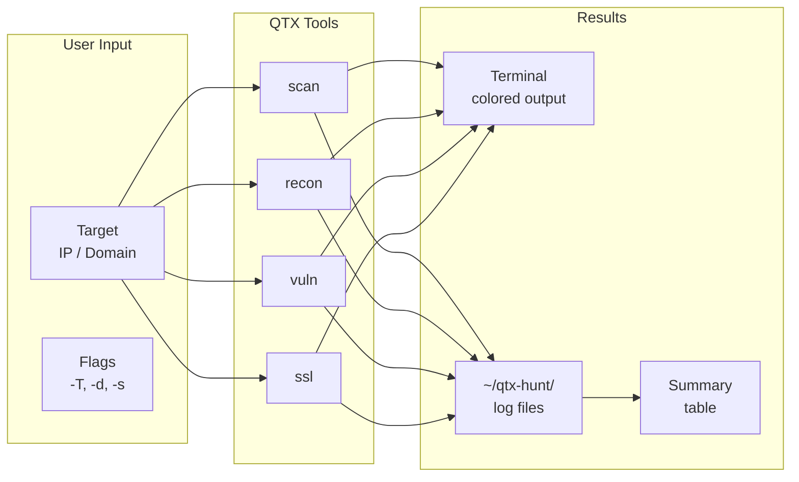
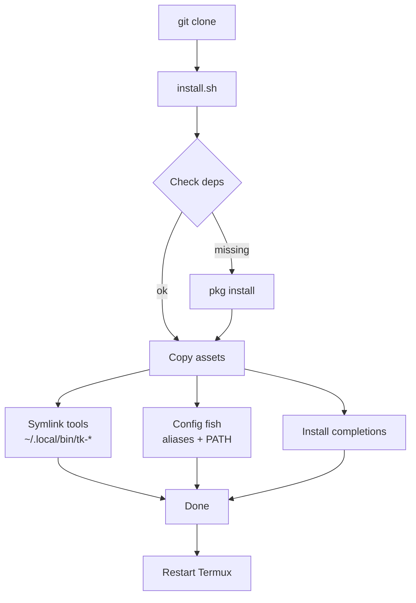
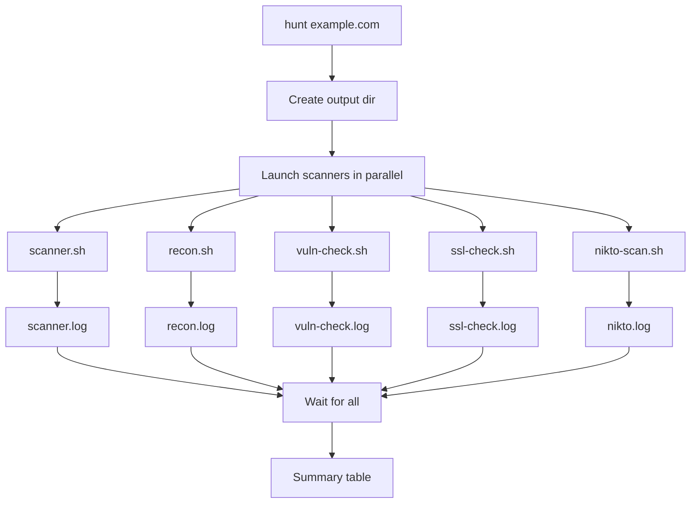

# QTX Architecture

## Tool Dependency Graph

```mermaid
graph TD
    subgraph Core["Core Layer"]
        colors["lib/colors.sh<br/>Output functions"]
        utils["lib/utils.sh<br/>Utilities"]
    end

    subgraph Tools["Security Tools (13)"]
        scanner["scanner.sh<br/>nmap wrapper"]
        recon["recon.sh<br/>OSINT recon"]
        audit["audit.sh<br/>Password auditor"]
        ssl["ssl-check.sh<br/>SSL inspector"]
        hashid["hash-id.sh<br/>Hash identifier"]
        logs["log-analyzer.sh<br/>Log analyzer"]
        vuln["vuln-check.sh<br/>Vuln scanner"]
        wifi["wifi-recon.sh<br/>WiFi scanner"]
        dirbrute["dir-brute.sh<br/>Directory brute"]
        nikto["nikto-scan.sh<br/>Nikto wrapper"]
    end

    subgraph Meta["Meta Tools (3)"]
        hunt["qtx-hunt.sh<br/>Parallel runner"]
        fm["qtx-fm.sh<br/>File manager"]
        net["qtx-net.sh<br/>Speed test"]
    end

    subgraph Setup["Setup"]
        setup["setup.sh<br/>Environment setup"]
        install["install.sh<br/>QTX installer"]
        uninstall["uninstall.sh<br/>Clean removal"]
    end

    subgraph Config["Config"]
        fish["config.fish<br/>Shell config"]
        completions["qtx.fish<br/>Tab completions"]
        starship["starship.toml<br/>Prompt config"]
    end

    %% Core deps
    scanner --> colors
    recon --> colors
    audit --> colors
    ssl --> colors
    hashid --> colors
    logs --> colors
    vuln --> colors
    wifi --> colors
    dirbrute --> colors
    nikto --> colors
    hunt --> colors
    fm --> colors
    net --> colors

    %% Hunt runs others
    hunt -.->|parallel| scanner
    hunt -.->|parallel| recon
    hunt -.->|parallel| vuln
    hunt -.->|parallel| ssl
    hunt -.->|parallel| nikto

    %% Setup
    install --> fish
    install --> completions
    install --> starship
```

## Data Flow

```mermaid
flowchart LR
    subgraph Input["User Input"]
        target["Target<br/>IP / Domain"]
        flags["Flags<br/>-T, -d, -s"]
    end

    subgraph QTX["QTX Tools"]
        scan["scan"]
        rec["recon"]
        vul["vuln"]
        sc["ssl"]
    end

    subgraph Output["Results"]
        stdout["Terminal<br/>colored output"]
        file["~/qtx-hunt/<br/>log files"]
        report["Summary<br/>table"]
    end

    target --> scan
    target --> rec
    target --> vul
    target --> sc

    scan --> stdout
    rec --> stdout
    vul --> stdout
    sc --> stdout

    scan --> file
    rec --> file
    vul --> file
    sc --> file

    file --> report
```

## Install Flow

```mermaid
flowchart TD
    A[git clone] --> B[install.sh]
    B --> C{Check deps}
    C -->|missing| D[pkg install]
    C -->|ok| E[Copy assets]
    D --> E
    E --> F[Symlink tools<br/>~/.local/bin/tk-*]
    E --> G[Config fish<br/>aliases + PATH]
    E --> H[Install completions]
    F --> I[Done]
    G --> I
    H --> I
    I --> J[Restart Termux]
```

## Parallel Execution (hunt)

```mermaid
flowchart TD
    A[hunt example.com] --> B[Create output dir]
    B --> C[Launch scanners in parallel]

    C --> D[scanner.sh]
    C --> E[recon.sh]
    C --> F[vuln-check.sh]
    C --> G[ssl-check.sh]
    C --> H[nikto-scan.sh]

    D --> I[scanner.log]
    E --> J[recon.log]
    F --> K[vuln-check.log]
    G --> L[ssl-check.log]
    H --> M[nikto.log]

    I --> N[Wait for all]
    J --> N
    K --> N
    L --> N
    M --> N

    N --> O[Summary table]
```
